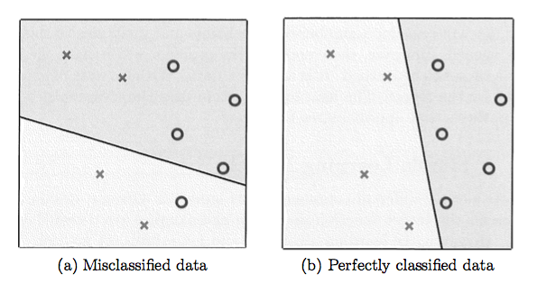
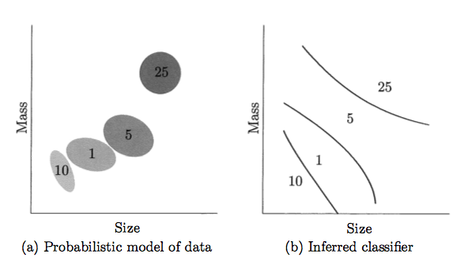

# Machine Learning 101

---

## "No aprendemos qué es un árbol al estudiar la definición matemática de uno, lo aprendimos mirándolos. En otras palabras, aprendimos de los datos" – *Abu-Mostafa (2012)*

---

# Parte II: El problema de aprendizaje

---

# 1. Formulación del problema

* Imagina que quisiéramos predecir la calificación que le daría una persona a una película
* El problema principal es que el criterio que usan las personas para calificar películas es muy complejo, ¿cómo lo modelamos de manera explícita?
* En vez de usar una solución analítica, podriamos usar información histórica y construir una **solución empírica**

---

# 1. Formulación del problema (II)

---

# 1.1 Componentes del problema de aprendizaje

---

# 1.1 Componentes del problema de aprendizaje

* Los componentes de un problema de aprendizaje son comunes a muchos problemas, para explicarlos usaremos el ejemplo de la aprobación de un crédito
* Supongamos que un banco recibe miles de solicitudes para tarjetas de crédito cada día y quiere automatizar el proceso de evaluación
* El  banco no tiene una fórmula que pueda señalar qué solicitudes se deben aprobar, pero tienes datos históricos
* Con información personal de cada cliente relacionada al crédito e información sobre si el banco ganó dinero con el crédito se decide constuir una solución empírica

---

# 1.1 Componentes del problema de aprendizaje (II)

Definamos los siguientes símbolos:

Entrada: $x$ (vector que representa la información del cliente)

La función objetivo (desconocida): $f: X \rightarrow Y$ (la fórmula **ideal** para la aprobación de créditos)

Donde $X$ es el espacio de entradas (todos los valores posibles que puede tomar $x$) y $Y$ el espacio de salida (posibles valores de salida, en este caso dar o no el crédito)

---

# 1.1 Componentes del problema de aprendizaje (III)

* Existe un grupo de datos $D = (x_1, y_1), ..., (x_n,y_n)$
* Donde $y_n=f(x_n)$ para $n=1,...,N$
* Existe un *algoritmo* que usa $D$ para escoger una fórmula $g: X \rightarrow Y$ que *aproxima* $f$
* El algoritmo escoge de una serie de candidatos bajo consideración al que llamaremos el espacio de hipótesis $H$
* El banco basará su decisión en $g$, no en $f$ (es desconocida). La decisión será buena dependiento de qué tan buena sea la aproximación
* Para ello el algoritmo escogerá la $g$ que mejor se acerque a $f$ usando los **datos de entrenamiento (training examples)** esperando que eso siga siendo válido para nuevos ejemplos

---

# 1.1 Componentes del problema de aprendizaje (IV)

---

# 1.2 Un modelo simple de aprendizaje

---

# 1.2 Un modelo simple de aprendizaje

* Los datos $D$ y la función objetivo $f$ son dictados por el problema, pero el *algoritmo de aprendizaje* y el espacio de hipótesis $H$ no
* El algoritmo es algo que escogemos nosotros
* Denominaremos al *algoritmo de aprendizaje* y a $H$ como el **modelo de aprendizaje**

---

# 1.2 Un modelo simple de aprendizaje (II)

* $H$ se especifica a través de una forma funcional que todas las $h \in H$ comparten
* Cada $h$ dara pesos específicos a cada uno de los elementos en el vector de entrada $x$, reflejando la importancia relativa en la decisión de otorgar el crédito
* Los valores de $x$ se combinan para dar un *score* y el resultado es comparador con un valor de referencia, si la persona supera la referencia se le dará el crédito

Aprobar crédito si: $\sum_{i=1}^{d} w_ix_i > referencia$

---

# 1.2 Un modelo simple de aprendizaje (III)

$$h(x) = \text{sign}(\sum_{i=1}^{d} w_ix_i - b)$$

* Se aprueba el crédito si $h(x)= +1$
 * Esto sucede cuando $\sum_{i=1}^{d} w_ix_i > b$
* Se rechaza el crédito si $h(x)= -1$
 * Esto sucede cuando $\sum_{i=1}^{d} w_ix_i < b$
* A este modelo se le conoce como *perceptron*

---

# 1.2 Un modelo simple de aprendizaje (IV)

* El algoritmo buscará en $H$ buscando los términos $w_i$ (pesos) y $b$ (referencia) que se desempeñen mejor en el conjunto de datos $D$
* Algunos $w_i$ pueden resultar negativos,  indicando un efector adverso en la aprobación de crédito (ej: deudas actuales)
* La selección **óptima** de pesos y referencia define la hipótesis final $g \in H$ que produce el algoritmo

---

# 1.2 Un modelo simple de aprendizaje (V)

---

# 1.2 Un modelo simple de aprendizaje (VI)

* Encontrar los *mejores* valores de $w_i$ y $b$ se vuelve un problema de **optimización** (usualmente se hace con métodos iterativos pues los modelos más complejos no tienen soluciones cerradas)
* Una vez que encontramos los valores debemos preguntarnos, ¿este modelo será exitoso en clasificar nuevos datos **no** incluidos en los datos de entrenamiento? Esta es la pregunta clave en la **teoría de aprendizaje**

---

# 1.3 Aprendizaje vs. Diseño

---

# 1.3 Aprendizaje vs. Diseño

* Existen formas de resolver problemas similares sin recurrir a la técncia de *aprendizaje*
* Una de ellas se conoce como *diseño* y es discutida de manera conjunta al *aprendizaje* en la literatura

---

# 1.3 Aprendizaje vs. Diseño (II)

* Consideremos el problema de reconocer monedas de diferentes denominaciones a través de su tamaño y masa
* En un enfoque de *aprendizaje* se nos da una muestra de monedas de de todas las denominaciones
* Es natural encontrar variación entre monedas de la misma denominación (debido a imperfecciones en su manufactura y errores de medición)
* Una vez que *entrenamos* un algoritmo, podemos recibir un nuevo punto y decidir a qué denominación pertenece

---

# 1.3 Aprendizaje vs. Diseño (III)

* En el enfoque de *diseño* le pediríamos a Banco de México un documento con las especificaciones de tamaño y masa de las monedas (nota que en este caso no tenemos datos empíricos)
* Después podríamos diseñar un modelo físico para tomar en cuenta las variaciones en las monedas debido a los errores de manufactura y medición
* Con el modelo calculamos la distribución conjunta del tamaño y masa para cada denominación, usando la distribución calculamos un *clasificador óptimo*

---

# 1.3 Aprendizaje vs. Diseño (IV)

* En el caso de diseño el problema está bien definido (debido a la especificación que tenemos) y se puede derivar **analíticamente** una $f$ sin necesidad de recolectar datos empíricos
* En el enfoque de aprendizaje el problema está mucho menos definido y es necesario recolectar datos para aproximar $f$
* Ambos enfoques son válidos en diferentes aplicaciones
* **Opinión polémica** El enfoque de diseño está más relacionado con el área de Estadística

---

# 1.3 Aprendizaje vs. Diseño (V)

---

# 1.4 Cuando *NO* usar Machine Learning

* Cuando el problema está bien definido y tenemos una idea de la forma de $f$ (nadie *cuerdo* usaría ML para "derivar" la ley de la gravitación universal)
* Cuando no es posible recolectar una cantidad razonable de datos
 * No datos = No aprendizaje
 * ¿Qué es una cantidad razonable? Depende mucho del problema

---

# 2. Tipos de aprendizaje

---

# 2. Tipos de aprendizaje

* La premisa básica del aprendizaje es que los datos provienen de un proceso que los genera
* Es difícil ubicar dicha premisa en un solo marco por lo que diferentes paradigmas de aprendizaje han surgido
* El que se mostró en la sección anterior se conoce como **aprendizaje supervisado (supervised learning)**
* Es el más común y más estudiado pero no el único como veremos a continuación

---

# 2.1 Aprendizaje Supervisado

---

https://twitter.com/amyhoy/status/847097034536554497

---

## Lectura recomendada

*Domingos, P. A Few Useful Things to Know about Machine Learning*

https://homes.cs.washington.edu/~pedrod/papers/cacm12.pdf

---

# Referencias

*Abu-Mostafa Y. et al. Learning From Data: A Short Course. 2012. amlbook.com*